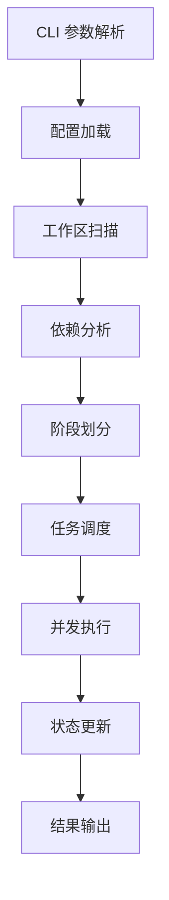

# MonoX 开发贡献指南

欢迎为 MonoX 项目贡献代码！本文档将帮助您了解项目架构、开发环境搭建和贡献流程。

## 📋 目录

- [项目架构](#-项目架构)
- [开发环境](#-开发环境)
- [代码规范](#-代码规范)
- [测试指南](#-测试指南)
- [贡献流程](#-贡献流程)
- [发布流程](#-发布流程)

## 🏗️ 项目架构

### 整体设计

MonoX 采用模块化架构，核心组件包括：

- **CLI 层** - 命令行接口和参数解析
- **核心引擎** - 依赖分析、任务调度、执行控制
- **数据模型** - 配置管理、包信息建模
- **工具层** - 文件系统、日志、性能监控
- **UI 层** - 进度显示、用户交互

### 目录结构详解

```
monox/
├── src/
│   ├── main.rs              # CLI 入口点
│   ├── cli/                 # 命令行接口模块
│   │   ├── mod.rs          # CLI 主模块，参数解析和路由
│   │   ├── analyze.rs      # analyze 命令实现
│   │   ├── check.rs        # check 命令实现（健康检查）
│   │   ├── exec.rs         # exec 命令实现（预定义任务）
│   │   ├── fix.rs          # fix 命令实现（问题修复）
│   │   ├── init.rs         # init 命令实现（配置初始化）
│   │   ├── run.rs          # run 命令实现（任务执行）
│   │   └── update.rs       # update 命令实现（依赖更新）
│   ├── core/               # 核心功能模块
│   │   ├── mod.rs          # 核心模块导出
│   │   ├── analyzer.rs     # 依赖关系分析器
│   │   ├── cache.rs        # 执行状态缓存管理
│   │   └── executor.rs     # 任务执行器
│   ├── models/             # 数据模型
│   │   ├── mod.rs          # 模型模块导出
│   │   ├── config.rs       # 配置数据结构
│   │   └── package.rs      # 包信息数据结构
│   ├── utils/              # 工具函数
│   │   ├── mod.rs          # 工具模块导出
│   │   ├── colors.rs       # 颜色输出工具
│   │   ├── constants.rs    # 常量定义
│   │   ├── fs.rs           # 文件系统操作
│   │   ├── logger.rs       # 统一日志系统
│   │   ├── npm.rs          # 包管理器工具
│   │   └── performance.rs  # 性能监控工具
│   ├── i18n/               # 国际化支持
│   │   ├── mod.rs          # 国际化主模块
│   │   ├── zh_cn.rs        # 中文翻译
│   │   └── en_us.rs           # 英文翻译
│   └── ui/                 # 用户界面
│       ├── mod.rs          # UI 模块导出
│       ├── runner.rs      # 非 verbose 模式终端输出 UI
│       └── verbose.rs      # 详细输出组件
├── test-packages/          # 集成测试用例
├── Cargo.toml             # Rust 项目配置
├── monox.toml             # MonoX 示例配置
└── DESIGN.md              # 详细设计文档
```

### 核心模块详解

#### 1. 依赖分析器 (analyzer.rs)

**职责**：
- 扫描 workspace 中的所有包
- 解析各包的依赖关系
- 构建依赖图并检测循环依赖
- 按依赖关系划分构建阶段

**核心算法**：
```rust
// 阶段划分算法伪代码
fn calculate_stages(dependency_graph: &Graph) -> Vec<Vec<Package>> {
    let mut stages = Vec::new();
    let mut remaining = all_packages();
    
    while !remaining.is_empty() {
        // 找到当前无依赖的包（或依赖已在前面阶段的包）
        let current_stage = remaining.iter()
            .filter(|pkg| pkg.dependencies_satisfied_in_previous_stages())
            .collect();
        
        stages.push(current_stage);
        remaining.retain(|pkg| !current_stage.contains(pkg));
    }
    
    stages
}
```

#### 2. 任务执行器 (executor.rs)

**职责**：
- 执行具体的构建任务
- 管理子进程和输出捕获
- 实时更新执行状态
- 提供进度反馈

**特性**：
- 支持超时控制
- 支持失败重试
- 实时输出流处理
- 性能监控集成

#### 3. 缓存管理 (cache.rs)

**职责**：
- 进程内跟踪已完成和正在运行的任务
- 避免重复执行已完成的任务
- 管理执行状态持久化

### 数据流设计



### 错误处理策略

- 使用 `anyhow` 进行统一错误处理
- 使用 `thiserror` 定义领域特定错误
- 分层错误处理：CLI 层、业务逻辑层、系统调用层
- 国际化错误消息支持

## 🛠️ 开发环境

### 系统要求

- **Rust**: 1.70.0 或更高版本
- **操作系统**: macOS, Linux, Windows
- **包管理器**: 支持 pnpm, npm, yarn（用于测试）

### 环境搭建

1. **克隆项目**
   ```bash
   git clone https://github.com/your-org/monox.git
   cd monox
   ```

2. **安装依赖**
   ```bash
   cargo make setup
   ```

3. **运行测试**
   ```bash
   cargo make test
   ```

4. **本地开发**
   ```bash
   # 开发模式运行
   ARGS='analyze' cargo make run
   
   # 启用详细日志
   RUST_LOG=debug ARGS='analyze --debug' cargo make run
   ```

### 开发工具推荐

- **IDE**: VS Code + rust-analyzer 插件
- **调试**: VS Code Debugger 或 `cargo make run`
- **格式化**: `cargo make fmt`
- **静态检查**: `cargo make lint`
- **文档生成**: `cargo make doc`

### 依赖库说明

#### 核心依赖
- **clap**: CLI 参数解析框架
- **serde**: 序列化/反序列化
- **tokio**: 异步运行时
- **anyhow**: 错误处理
- **toml**: 配置文件解析

#### 工具依赖
- **petgraph**: 图算法库（依赖分析）
- **semver**: 版本比较
- **glob**: 文件匹配
- **reqwest**: HTTP 请求（版本检查）
- **indicatif**: 进度条显示
- **colored**: 彩色输出
- **tracing**: 结构化日志

## 📝 代码规范

### Rust 代码风格

遵循标准 Rust 代码风格：

```bash
# 格式化代码
cargo make fmt

# 静态检查
cargo make lint

# 文档检查
cargo make doc
```

### 命名约定

- **模块名**: snake_case
- **结构体**: PascalCase
- **函数**: snake_case
- **常量**: SCREAMING_SNAKE_CASE
- **枚举**: PascalCase，变体也是 PascalCase

### 文档规范

```rust
/// 分析工作区中的包依赖关系
/// 
/// # 参数
/// 
/// * `workspace_root` - 工作区根目录路径
/// * `config` - MonoX 配置
/// 
/// # 返回值
/// 
/// 返回 `Result<DependencyGraph, AnalyzerError>`
/// 
/// # 示例
/// 
/// ```rust
/// let graph = analyzer.analyze_dependencies(&workspace_root, &config)?;
/// ```
pub fn analyze_dependencies(
    &self,
    workspace_root: &Path,
    config: &Config,
) -> Result<DependencyGraph, AnalyzerError> {
    // 实现...
}
```

### 错误处理

```rust
use anyhow::{Context, Result};
use thiserror::Error;

#[derive(Error, Debug)]
pub enum AnalyzerError {
    #[error("循环依赖检测到: {packages:?}")]
    CircularDependency { packages: Vec<String> },
    
    #[error("包 {package} 未找到")]
    PackageNotFound { package: String },
}

pub fn analyze_workspace(path: &Path) -> Result<Workspace> {
    let packages = scan_packages(path)
        .context("扫描包失败")?;
    
    Ok(Workspace { packages })
}
```

### 国际化规范

所有用户可见的文本都必须使用 i18n 宏：

```rust
use crate::i18n::{t, tf};
use crate::utils::logger::Logger;

// 简单文本
Logger::info(t!("analyze.start"));


// 带参数的文本
Logger::info(tf!("analyze.found_packages", packages.len()))
```

在翻译文件中添加对应的键值：

```rust
// src/i18n/zh_cn.rs
pub const TRANSLATIONS: &[(&str, &str)] = &[
    ("analyze.start", "开始分析依赖关系..."),
    ("analyze.found_packages", "找到 {} 个包"),
];

// src/i18n/en_us.rs
pub const TRANSLATIONS: &[(&str, &str)] = &[
    ("analyze.start", "Starting dependency analysis..."),
    ("analyze.found_packages", "Found {} packages"),
];
```

## 🧪 测试指南

### 测试结构

```
tests/
├── integration/         # 集成测试
│   ├── analyze_test.rs
│   ├── run_test.rs
│   └── common/         # 测试工具
├── fixtures/           # 测试数据
│   ├── simple-workspace/
│   └── complex-workspace/
└── unit/              # 单元测试（在各模块中）
```

### 测试数据管理

在 `test-packages/` 目录下维护测试用的 workspace：

```
test-packages/
├── simple-workspace/    # 简单依赖关系
│   ├── package.json
│   ├── packages/
│   │   ├── pkg-a/
│   │   └── pkg-b/
│   └── monox.toml
└── complex-workspace/   # 复杂依赖关系
    ├── package.json
    ├── packages/
    └── monox.toml
```

### 性能测试

```rust
use std::time::Instant;

#[test]
fn test_large_workspace_performance() {
    let start = Instant::now();
    
    let analyzer = DependencyAnalyzer::new();
    let result = analyzer.analyze_large_workspace();
    
    let duration = start.elapsed();
    assert!(duration.as_secs() < 5, "分析耗时过长: {:?}", duration);
}
```

## 🔄 贡献流程

### 1. 准备工作

1. **Fork 项目**到您的 GitHub 账户
2. **克隆 Fork**到本地
3. **创建功能分支**
   ```bash
   git checkout -b feature/your-feature-name
   ```

### 2. 开发流程

1. **编写代码**
   - 遵循代码规范
   - 添加必要的测试
   - 更新文档

2. **本地测试**
   ```bash
   cargo make ci
   ```

3. **提交代码**
   ```bash
   git add .
   git commit -m "feat: 添加新功能描述"
   ```

### 3. 提交 Pull Request

1. **推送分支**
   ```bash
   git push origin feature/your-feature-name
   ```

2. **创建 PR**
   - 填写详细的 PR 描述
   - 关联相关的 Issue
   - 添加适当的标签

3. **代码审查**
   - 响应审查意见
   - 及时修复问题
   - 保持 PR 更新

### 提交消息规范

使用 [Conventional Commits](https://www.conventionalcommits.org/) 规范：

```
<type>[optional scope]: <description>

[optional body]

[optional footer(s)]
```

**类型说明**：
- `feat`: 新功能
- `fix`: 错误修复
- `docs`: 文档更新
- `style`: 代码格式调整
- `refactor`: 代码重构
- `test`: 测试相关
- `chore`: 构建过程或辅助工具的变动

**示例**：
```
feat(analyzer): 添加循环依赖检测功能

- 实现基于 DFS 的循环依赖检测算法
- 添加详细的错误报告
- 支持多语言错误消息

Closes #123
```

## 🚀 发布流程

### 版本管理

使用 [Semantic Versioning](https://semver.org/)：

- **MAJOR**: 不兼容的 API 变更
- **MINOR**: 向后兼容的功能新增
- **PATCH**: 向后兼容的错误修复

### 发布步骤

1. **更新版本号**
   ```bash
   # 更新 Cargo.toml 中的版本号
   vim Cargo.toml
   ```

2. **更新 CHANGELOG**
   ```bash
   # 记录本次发布的变更
   vim CHANGELOG.md
   ```

3. **创建发布标签**
   ```bash
   git tag -a v0.2.0 -m "Release v0.2.0"
   git push origin v0.2.0
   ```

4. **构建发布版本**
   ```bash
   cargo make release
   ```

5. **发布到 crates.io**
   ```bash
   cargo publish
   ```

### 发布检查清单

- [ ] 所有测试通过
- [ ] 文档已更新
- [ ] CHANGELOG 已更新
- [ ] 版本号已更新
- [ ] 发布说明已准备

## 🤝 社区参与

### 报告问题

使用 GitHub Issues 报告问题时，请提供：

- **环境信息**: 操作系统、Rust 版本、MonoX 版本
- **重现步骤**: 详细的操作步骤
- **期望行为**: 您期望发生什么
- **实际行为**: 实际发生了什么
- **相关日志**: 错误消息或调试输出

### 功能请求

提交功能请求时，请说明：

- **使用场景**: 为什么需要这个功能
- **预期行为**: 功能应该如何工作
- **替代方案**: 是否有其他解决方案

### 讨论参与

- 参与 GitHub Discussions
- 回答其他用户的问题
- 分享使用经验和最佳实践

## 📚 学习资源

### Rust 学习
- [The Rust Programming Language](https://doc.rust-lang.org/book/)
- [Rust by Example](https://doc.rust-lang.org/rust-by-example/)
- [The Cargo Book](https://doc.rust-lang.org/cargo/)

### 相关技术
- [Tokio 异步编程](https://tokio.rs/tokio/tutorial)
- [Clap CLI 框架](https://docs.rs/clap/latest/clap/)
- [Serde 序列化](https://serde.rs/)

感谢您对 MonoX 项目的贡献！🎉 