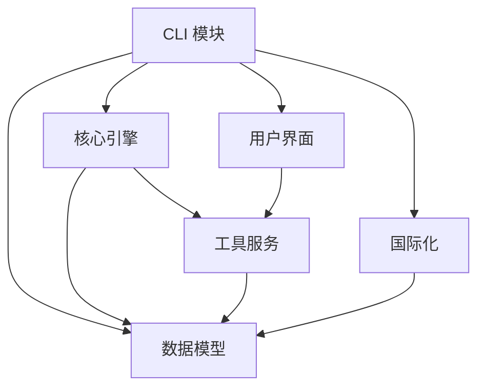

# MonoX 技术设计文档

## 📋 概述

本文档描述 MonoX 的项目设计理念、核心架构设计和关键技术决策。

> 💡 **文档导航**
>
> - 用户使用指南：[README.md](README.md)
> - 开发贡献指南：[CONTRIBUTING.md](CONTRIBUTING.md)
> - 技术设计文档：本文档

## 🎯 设计目标

### 核心原则

1. **性能优先** - 最大化并发执行，最小化等待时间
2. **安全可靠** - 严格的依赖检查，防止构建错误
3. **用户友好** - 清晰的进度显示，直观的错误报告
4. **可扩展性** - 模块化设计，易于扩展新功能
5. **跨平台** - 支持主流操作系统和包管理器

### 性能指标

- **启动时间**: < 100ms（冷启动）
- **分析速度**: 1000+ 包/秒
- **内存使用**: < 50MB（中等规模项目）
- **并发效率**: 接近 CPU 核心数的线性扩展

## 🏗️ 系统架构

### 分层架构设计

```
┌─────────────────────────────────────────┐
│                CLI 层                    │  ← 用户接口
├─────────────────────────────────────────┤
│              业务逻辑层                   │  ← 命令处理
├─────────────────────────────────────────┤
│               核心引擎层                  │  ← 核心算法
├─────────────────────────────────────────┤
│               数据模型层                  │  ← 数据结构
├─────────────────────────────────────────┤
│               工具服务层                  │  ← 基础服务
└─────────────────────────────────────────┘
```

### 模块依赖关系



### 任务阶段解析方案

#### 获取任务阶段策略

```
MonoX 依赖分析算法设计
workspace_packages 获取方案：
  1. 扫描 monorepo 所在目录非 node_modules 以及 workspace.ignore 目录下所有 package.json 文件
  2. 查找所有 package.json 文件（node_modules 目录始终被排除）
  3. 获取 package.json 中的 name 字段以及 package.json 所在目录相对路径

1. 获取所有 monorepo 的 package 关键信息存储于字典 workspace_packages 中
   结构为 { name: <包名>, folder: <monorepo 根目录相对路径>, dependencies: 采集自 dependencies/dev_dependencies/peer_dependencies 合并 }

2. 创建变量缓存未加入阶段的包名: unstage_packages 格式 <package_name>[]

3. 开始进行执行阶段线路捕获，阶段信息存储 stages: [ [ { name: <包名>, folder: <monorepo 根目录相对路径>}, ... ], ... ]

4. 遍历 unstage_packages 包 package_try_add，关键优化：下次重新遍历 unstage_packages 时，
   都应该尝试把遍历到的 package_try_add 加入第一个阶段
   （常理来说不可能进入第一阶段，但是这个规则，必须尝试往靠前阶段加入）

   遍历操作 A: 获取 package_try_add 的 dependencies, 提取 dependencies 中存在于 workspace_packages 的包存储于 priority_dependencies

   若没有工作空间依赖：
     - 直接加入阶段0（如果不存在则创建）

   若有工作空间依赖：
     - 从第一个阶段开始尝试，找到第一个可以加入的阶段
     - 开始遍历 priority_dependencies - pkg_dep
         - 判断 pkg_dep 是否已经存在于之前阶段中(stages[0] - stages[stage_idx-1])
             - 若已经存在, 遍历下一个
             - 若没有，中断遍历, package_try_add 尝试加入 stages[stage_idx] 失败
         - 遍历自然结束，所有依赖都已满足，package_try_add 可直接加入 stages[stage_idx]
     - 如果所有现有阶段都不能加入，创建新阶段（前提是所有依赖都已在之前阶段构建完成）

5. 包加入阶段后从 unstage_packages 中移除，一直循环遍历直到 unstage_packages 长度为 0
   注意：被依赖的包必须在前一个阶段构建，不需要递归
```

#### 获取任务阶段方式

- 完整项目阶段获取, 获取 monorepo 下所有包的任务阶段执行顺序
- 单包任务阶段获取, 获取目标包的任务阶段执行顺序

### 核心模块职责

#### CLI 层

- **命令解析**: 处理用户输入的命令和参数
- **参数验证**: 验证命令参数的合法性
- **结果展示**: 格式化输出执行结果

#### 业务逻辑层

- **analyze**: 依赖关系分析和阶段划分
- **run/exec**: 任务执行和调度
- **check**: 健康检查和问题诊断
- **fix/update**: 问题修复和依赖更新

#### 核心引擎层

- **DependencyAnalyzer**: 依赖关系分析和图构建
- **TaskScheduler**: 任务调度和执行计划
- **TaskExecutor**: 任务执行和状态管理
- **CacheManager**: 缓存策略和状态持久化

#### 数据模型层

- **Config**: 配置管理和验证
- **Package**: 包信息和依赖关系
- **Task**: 任务定义和状态
- **Result**: 执行结果和错误信息

#### 工具服务层

- **Logger**: 统一日志和国际化(以[MONOX]开头打印)
- **FileSystem**: 文件操作和路径处理
- **PackageManager**: 包管理器适配
- **Performance**: 性能监控和优化

## 🧠 核心设计

### 1. 依赖关系分析

#### 设计思路

- 使用有向无环图（DAG）表示包依赖关系
- 采用拓扑排序算法划分构建阶段
- 基于 Kahn 算法实现高效的阶段计算
- 使用强连通分量检测循环依赖

#### 阶段划分策略

```
阶段 1: 无依赖的包（叶子节点）
阶段 2: 仅依赖阶段 1 的包
阶段 3: 仅依赖阶段 1,2 的包
...
阶段 N: 依赖前面所有阶段的包
```

#### 循环依赖处理

- 使用 DFS 算法检测强连通分量
- 提供详细的循环依赖路径信息
- 支持循环依赖的可视化展示

### 2. 任务调度系统

#### 调度策略

- **阶段内并发**: 同一阶段的任务可以并发执行
- **优先级调度**: 基于依赖深度和预估时间的优先级
- **资源限制**: 可配置的最大并发数控制
- **失败处理**: 支持重试和错误恢复策略

#### 并发控制

- **静态限制**: 基于配置的固定并发数
- **动态调整**: 根据系统负载自适应调整
- **资源感知**: 考虑 CPU、内存、I/O 等资源状况
- **任务特性**: 根据任务类型调整并发策略

### 3. 缓存系统

#### 多级缓存架构

- **L1 内存缓存**: 当前会话的热数据
- **L2 磁盘缓存**: 跨会话的持久化数据
- **L3 网络缓存**: 团队共享的远程缓存（可选）

#### 缓存策略

- **缓存键设计**: 包名 + 版本 + 命令 + 依赖哈希
- **失效策略**: 基于时间和依赖变更的失效机制
- **回填策略**: 多级缓存间的数据同步
- **压缩存储**: 减少磁盘和网络传输开销

### 4. 错误处理

#### 分层错误处理

- **系统级错误**: I/O 错误、网络错误等
- **业务级错误**: 依赖冲突、构建失败等
- **用户级错误**: 配置错误、参数错误等

#### 错误恢复策略

- **重试机制**: 可配置的重试次数和延迟
- **降级策略**: 部分失败时的备选方案
- **错误聚合**: 批量操作的错误汇总
- **上下文保留**: 错误发生时的完整上下文信息

## 📊 性能优化策略

### 核心优化方向

- **启动优化**: 延迟加载、配置缓存、并行初始化
- **执行优化**: 智能调度、资源池化、流水线处理
- **内存优化**: 对象复用、惰性求值、及时回收
- **I/O 优化**: 异步操作、批量处理、预读策略

## 🔧 关键设计决策

### 1. 技术栈选择

#### Rust 语言

- **性能**: 零成本抽象和内存安全
- **并发**: 优秀的并发编程支持
- **生态**: 丰富的 crates 生态系统
- **跨平台**: 良好的跨平台支持

#### 核心依赖库

- **clap**: 强大的 CLI 参数解析
- **tokio**: 高性能异步运行时
- **petgraph**: 专业的图算法库
- **serde**: 高效的序列化框架

### 2. 架构模式

#### 模块化设计

- **单一职责**: 每个模块专注特定功能
- **松耦合**: 模块间通过接口交互
- **高内聚**: 相关功能集中在同一模块
- **可测试**: 便于单元测试和集成测试

#### 异步优先

- **非阻塞**: 避免阻塞主线程
- **高并发**: 支持大量并发任务
- **资源高效**: 减少线程和内存开销
- **响应性**: 保持用户界面响应

### 3. 数据流设计

#### 执行流程

```
exec/run: 配置加载 → 工作区扫描 → 循环依赖检查(有循环依赖直接异常退出) → 依赖分析 → 阶段划分 → 任务调度 → 并发执行 → 结果汇总
其他命令: 配置加载 → 工作区扫描 → 依赖分析 → 阶段划分 → 任务调度 → 并发执行 → 结果汇总
```

#### 数据传递

- **不可变数据**: 避免并发访问冲突
- **消息传递**: 通过通道传递数据
- **共享状态**: 最小化共享可变状态
- **生命周期**: 明确的数据生命周期管理

### 4. 用户体验设计

#### 进度反馈

- **实时进度**: 显示当前执行状态
- **阶段信息**: 展示构建阶段和依赖关系
- **错误提示**: 清晰的错误信息和建议
- **性能指标**: 执行时间和资源使用情况

#### 国际化支持

- **多语言**: 支持中文和英文界面
- **动态切换**: 运行时语言切换
- **完整翻译**: 所有用户可见文本本地化
- **文化适配**: 考虑不同文化的使用习惯

## 🔮 扩展性设计

### 核心扩展能力

- **插件系统**: 标准化插件接口，支持动态加载和生命周期管理
- **包管理器扩展**: 适配器模式支持多种包管理器，自动检测和配置覆盖
- **输出格式扩展**: 可插拔格式化器，支持多种输出格式和模板系统
- **监控集成**: 标准化指标接口，支持分布式追踪和可视化监控

## 📈 质量保证

### 测试和质量策略

- **多层测试**: 单元测试、集成测试、端到端测试、性能测试
- **代码质量**: 静态分析、格式化标准、完整文档、代码审查
- **稳定性**: 全面错误处理、资源管理、并发安全、向后兼容

## 🚀 未来演进

### 短期目标（1-3 个月）

- **性能优化**: 自适应并发控制和内存优化
- **功能增强**: 更多包管理器支持和插件系统
- **用户体验**: 改进进度显示和错误消息

### 中期目标（3-6 个月）

- **分布式支持**: 远程缓存和分布式构建
- **智能化**: 基于机器学习的优化建议
- **生态集成**: CI/CD 和 IDE 集成

### 长期目标（6+ 个月）

- **云原生**: Kubernetes 和容器化支持
- **企业级**: 权限管理和审计功能
- **AI 增强**: 智能错误诊断和优化建议

---

本文档将随着项目发展持续更新。如有技术问题或建议，请参与 [GitHub Discussions](https://github.com/your-org/monox/discussions)。
